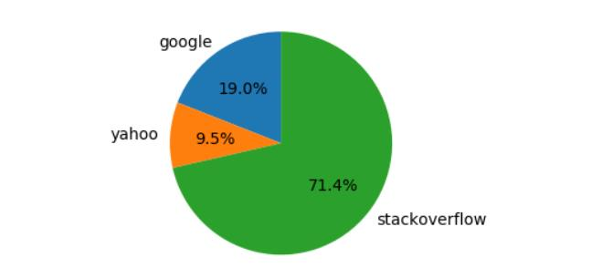

# Research and Analysis

Figure 1 Meta Search Engine

Analysis of various MSE source code and various application programming interfaces have been done and web scraping using selenium and BeautifulSoup is finalized.
	

Figure 2 Search Engines URL

From line 1-7 all search engines urls are defined and everytime query string in each url  will be replaced by the user's query. 

# Creation of basic structure of Meta Search Engine
For a single query results card component is made. For each query title, url and description is shown in the result.

Figure 3 Query Result Structure

Line 1-2 is used for importing modules and css files. From line 5-24 functional components for each query are defined which are used to display query results.

# Home Page of MSE
Below image represents what the search page will look like. Selection of various categories is also implemented here. 

Figure 4 Home Page Element

If no category is selected then as by general category google and yahoo search engine results will be displayed as default results. In line 48-82 an element of the home page is returned which is made using jsx.

# Selection of search engine based on keywords
Various keyword choices are given to users as shown in below figure and based on these keyword search engines will be selected.

Figure 5 Keywords Selection

If no search engine is selected then results will be shown from google and yahoo search engine. 

In Figure 6, Line 6-12 defines various keywords which will be shown in the frontend section and by default all variables are set to false.

Figure 6 Category Update function

Query is updated by the onQueryChange function in Line 16-18. Category will be updated by a function named updateCategory which is defined in Line 20-24.

Search function chooses the search engines based on the categories selected by
the user 

Figure 7 Search Function

From line 30-38 object named engines is created with all the search engines as keys. Values of search engines are set to true based on the categories selected by the user. Default values of google and yahoo are set to true.

# Get Common Results and Sorting based on document Frequency
setCommonResult finds all the search with same url and add it to the result
page.

Figure 8 Common Result and Frequency Based Sorting

From line 59-64 all the results are iterated and the urls of the results are mapped with their frequency and stored in an object named urlFreq. From line 68-71 all the urls with frequency over 1 are stored in an array which are then sorted from line 72-76 using sort function. 

# Implementation of Search Engines
Seven search engines have been added to MSE. Search Engines are Google for getting Google results, Yahoo for getting yahoo results, Pubmed for getting results for Medical, Stackoverflow for programming related results, Google News for news results, Google Scholar for research related results and Google Books for books related results. 

Figure 9 Google Search Engine Result

In Line 4 googleSearch function is defined which returns all the
results from Google search engine. In Line 6 a get request is made to google which gives google result page in response and scraping of response page is implemented from Line 9-32. In Line 33 JSON result is returned which contains the name of the engine and list of document objects.

In Line 4,PubmedSearch function is defined for medical related query. PubmedSearch function returns results of three pages which is shown in Line 6 in Figure 11.

Figure 10 Pubmed Result

In Line 7 of Figure 10 GET request is made to get the result page and then using BeautifulSoup scraping of the result is done. In Line 24 of Figure 9 the final list of documents is returned along with the name of the search engine.

In Line 4 of Figure 11 stackoverflowSearch function is defined which returns results of programming related query and regular expression is used for removing some unwanted characters.

Figure 11 Stackoverflow Result

In Line 5 the url is defined for GET requests. In Line 8 response is returned and stored in the res variable. In Line 14 stackoverflow results are returned along with the name of the search engine.

In Line 4 of Figure 12 yahooSearch function is defined which returns results from yahoo search engine. In Line 6 GET request is made to yahoo to get the result page.

Figure 12 Yahoo Result

From Line 9-27 scraping of the yahoo result page is implemented using selenium and stored in a data variable which stores a list of documents. In Line 29 of Figure 12 the list of documents along with the name of the engine is returned.

# Sorting based on occurrence of query keyword
The search query sent by the user may contain single or multiple words. Each word is considered to be a keyword. The keywords may occur different times within the webpages of the search results. The search results have been sorted on the basis of the count of keywords in their respective web pages.

Figure 13 Keyword Count

From line 20-24 of Figure 13, every keyword in the search query is added as a key in word count object with an assigned value 0. From line 26-29, the count of keywords in the webpage is counted individually and overall count is stored in the total variable. The total count is passed to the data object as seen on line 31.	
	

	Figure 14 Result Sorting

In line 72 of Figure 14, the product of frequency of the url and total count of keywords within the url is stored inside the allResult array and the product is then used to the result in line 79. Then in line 85, the sorted results are displayed to the user. 

# Implementation of Query keyword sorting and merging of results

Figure 15 Search Results of Query-React Js

In Figure 15, search results of the query React Js are displayed to the user in four tabs. All tabs show results after sorting the urls on the basis of count of keywords and frequency of the url. 

Figure 16 Json Format of Search Results- React Js

In Figure 16, the Json file of all the search results of query React Js are shown. As visible on the highlighted line the total counis-reactjs” and therefore the same url is displayed on the top in Figure 14.

# Experimental Results
For analyzing the search results of our proposed MSE, different search queries, each with a different count of keywords, are entered. It is made sure that all the categories are selected at least once so that all the search engines are used to fetch the results.

Figure 17: Search result percentage distribution for query “what is function”

The above Figure 17 is a pie chart which shows the percentage of search results fetched from the respective search engines, for the search query- “what is function”. Programming category is selected and therefore the search engine used other than Google and Yahoo is Stackoverflow.
In the result there were a total of 42 URLs out of which 8 were from google, 4 from yahoo and 30 from stackoverflow. Hence the percentage calculated are 19.0%, 9.5% and 71.4% for google, yahoo and stackoverflow respectively.

Figure 18: Search result percentage distribution for query “corona vaccine”

The next search query entered is “corona vaccine”. Categories selected are Research and Medical and therefore the search engines used are Google Scholar and PubMed respectively. The pie chart in Figure 18  shows the percentage distribution for the same.

Figure 19: Search result percentage distribution for query “Harry Potter”

The next search query entered is “Harry Potter” to make use of Google Books search engine which falls under the Books category. In Figure 19, the pie chart shows the results percentage for the same query.

  Figure 20: Search result percentage distribution for query “tablet for java”

The final query entered is “tablet for java” and all the categories are selected in order to fetch results from all the search engines present in the MSE. The pie chart in the above Figure 20 displays the percentage of search results for the same query.
